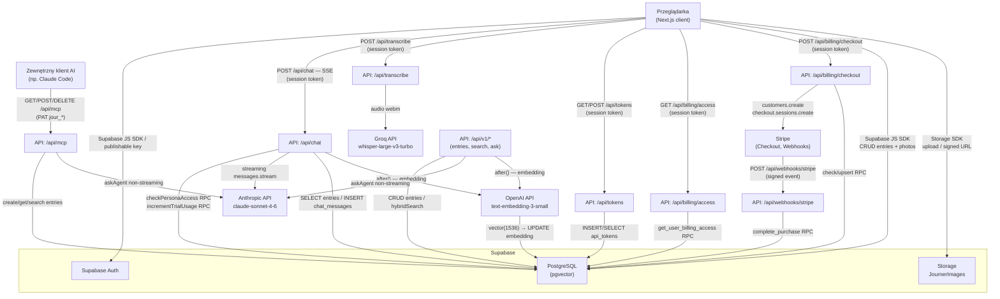

# Architektura systemu Journer

> Wygenerowano: 2026-06-15 (zaktualizowano: 2026-06-19 — Stripe billing, bottom nav, kalendarz, agent standalone, TOCTOU fix, obrona głęboka)

## Przegląd systemu

Journer to aplikacja webowa do codziennego journalingu. Użytkownik zapisuje dzienne wpisy tekstowe z oceną nastroju, może dołączać zdjęcia i nagrania głosowe. System udostępnia agentów AI w trzech osobach: Ryan Holiday (darmowy), Carl Jung i Alan Watts (premium, jednorazowy zakup przez Stripe). Agenci prowadzą dialog w kontekście aktualnego wpisu i historii dziennika, korzystając z wyszukiwania hybrydowego. Historia czatu jest izolowana per persona. Aplikacja wystawia również endpoint MCP (Model Context Protocol), pozwalający zewnętrznym klientom AI (np. Claude Code) czytać i pisać dziennik przez standardowy protokół narzędziowy. Całość działa na Next.js 16 (App Router) z backendem Supabase i jest hostowana na Vercel.

---

## Diagram architektury

---

## Komponenty

### Frontend (client-side)

| Moduł | Odpowiedzialność | Technologia |
|---|---|---|
| `(auth)` route group | Strony logowania i rejestracji | Supabase Auth JS |
| `(app)` route group | Chronione przez `AuthGuard`; wymaga aktywnej sesji | Next.js App Router |
| `/journal` | Lista wpisów posortowana od najnowszego | React, `useEntries` hook |
| `/journal/[id]` | Szczegóły i edycja wpisu + panel czatu | Tiptap, `ChatPanel` |
| `/calendar` | Miesięczny widok kalendarza — nawigacja Poprzedni/Następny miesiąc; klikalne dni z wpisem prowadzą do `/journal/[id]`; dni z aktywnością (wpis lub zdjęcie) oznaczone kropką | React, `useEntries`, `usePhotoDateSet` |
| `/agent` | Samodzielna strona agenta AI bez edytora — kontekst z dzisiejszego wpisu (lub ostatniego dostępnego); identyczny `ChatPanel` jak w widoku wpisu | React, `dynamic` import `ChatPanel` |
| `/settings` | Ustawienia użytkownika (PAT, profil) | React |
| `/docs` | Interaktywna dokumentacja API v1 i MCP | Statyczna strona React |
| `TiptapEditor` | Edytor WYSIWYG (bold, italic, listy) | Tiptap 3 (ProseMirror) |
| `VoiceRecorder` | Nagrywanie audio → transkrypcja → wstawienie do edytora | Web Audio API |
| `ChatPanel` | Czat z wybranym agentem; odbiera SSE; fetchuje stan dostępu do premium person; obsługuje flow zakupu | React, fetch streaming |
| `PersonaSelector` | Wybór persony; dynamiczny stan locked/unlocked z `/api/billing/access` | React |
| `PersonaUpgradeModal` | Modal z info o trialu i przyciskiem zakupu Stripe | React |
| `PhotoStrip` | Galeria zdjęć, upload i usuwanie | Supabase Storage SDK |
| `MoodSelector` | Wybór nastroju w skali 1–5 | React |
| `BottomNav` | Dolna nawigacja — przełączanie między Wpisem (`/journal`), Kalendarzem (`/calendar`) i Agentem (`/agent`); layout `(app)` ma `pb-20` zapobiegające przykryciu treści | React |
| `AuthGuard` | Sprawdza sesję, przekierowuje do `/login` | `useAuth` hook |

### Warstwa biblioteczna (`src/lib/`)

| Plik | Odpowiedzialność |
|---|---|
| `supabase.ts` | Klient Supabase z publishable key — używany po stronie klienta |
| `supabase-admin.ts` | Klient Supabase z secret key — używany wyłącznie po stronie serwera |
| `db.ts` | CRUD na tabeli `entries` wywoływany z hooków client-side |
| `journal-ops.ts` | Logika serwera: `hybridSearch`, `createOrUpdateEntry`, `getEntry`, `askAgent` |
| `chat-agent.ts` | Pętla agenta non-streaming; definicja narzędzia `get_entry` |
| `chatSystemPrompt.ts` | Buduje system prompt wybranej persony (Ryan / Jung / Watts) |
| `personas.ts` | Konfiguracja trzech person: `ryan` (unlocked), `jung`, `watts` (premium) |
| `billing.ts` | Logika billingowa: `getUserAccess`, `checkPersonaAccess`, `incrementTrialUsage`, lazy `getStripe()` |
| `billing-db.ts` | Niskopoziomowe operacje billing przez admin client: RPC calls do schematu `billing` |
| `embeddings.ts` | Generuje embeddingi przez OpenAI `text-embedding-3-small` |
| `api-auth.ts` | Walidacja PAT: format `jour_*`, lookup SHA-256 w `api_tokens` |
| `photos.ts` | Upload, usuwanie i signed URL dla zdjęć w Supabase Storage |
| `storage.ts` | Adapter localStorage (pozostałość z Fazy 1) |

### API Routes

| Endpoint | Metoda | Uwierzytelnienie | Opis |
|---|---|---|---|
| `/api/chat` | POST | session token | Streaming SSE — wybrany agent (Ryan/Jung/Watts) z pętlą tool_use; sprawdza dostęp do premium person |
| `/api/billing/access` | GET | session token | Zwraca stan dostępu i trial dla premium person (`{ jung: { unlocked, trialRemaining }, watts: ... }`) |
| `/api/billing/checkout` | POST | session token | Tworzy Stripe Checkout Session; zapisuje pending purchase; zwraca `checkoutUrl` |
| `/api/webhooks/stripe` | POST | Stripe signature | Odbiera eventy Stripe; `checkout.session.completed` → markuje purchase jako completed |
| `/api/transcribe` | POST | session token | Audio webm → tekst przez Groq Whisper |
| `/api/tokens` | GET, POST | session token | Lista i tworzenie Personal Access Tokens |
| `/api/tokens/[id]` | DELETE | session token | Usuwanie PAT |
| `/api/mcp` | GET, POST, DELETE | PAT | Endpoint MCP (Streamable HTTP transport); używa wyłącznie persony Ryan (darmowej) |
| `/api/v1/entries` | POST | PAT | Utwórz lub zaktualizuj wpis |
| `/api/v1/entries/[date]` | GET | PAT | Pobierz wpis po dacie (YYYY-MM-DD) |
| `/api/v1/search` | POST | PAT | Wyszukiwanie hybrydowe |
| `/api/v1/ask` | POST | PAT | Zapytaj agenta (bez streamingu) |

> **Uwaga dot. uwierzytelnienia:** Endpointy `/api/billing/*` i `/api/webhooks/stripe` nie obsługują PAT — tylko session token (billing jest wewnętrzny dla UI).

---

## Źródła danych

### Supabase PostgreSQL — schemat `public`

| Tabela | Co przechowuje | Uwagi |
|---|---|---|
| `entries` | Wpisy dziennika: `id` UUID, `user_id`, `date` (YYYY-MM-DD), `title`, `body` (HTML), `mood` (1–5), `created_at`, `updated_at`, `embedding` vector(1536). Constraint: `unique(user_id, date)`. | RLS: każdy widzi tylko swoje. |
| `chat_messages` | Historia czatu z agentem: `id`, `user_id`, `role` (user/assistant), `content`, `persona` (ryan/jung/watts), `created_at`. | Historia izolowana per persona (filtr `.eq("persona", persona)` zarówno przy odczycie jak i zapisie). |
| `api_tokens` | Personal Access Tokens: `id`, `user_id`, `token_hash` (SHA-256), `name`, `created_at`, `last_used_at`. | Lookup po hashu przy każdym żądaniu PAT. |
| `entry_photos` | Metadane zdjęć: `id`, `user_id`, `date`, `storage_path`, `created_at`. Indeks na `(user_id, date)`. | Zdjęcia serwowane przez Supabase Storage signed URL (TTL 3600s). |

### Supabase PostgreSQL — schemat `billing`

Schemat niedostępny przez PostgREST (brak ekspozycji). Dostęp wyłącznie przez admin client (service_role) — bezpośrednie zapytania do schematu `billing` z pominięciem RLS (obrona głęboka: funkcje nie używają `SECURITY DEFINER`; atomowe operacje realizowane przez SQL RPC bez eskalacji uprawnień). RLS: deny-all na wszystkich tabelach.

| Tabela | Co przechowuje |
|---|---|
| `billing.customers` | Mapowanie `user_id → stripe_customer_id` |
| `billing.purchases` | Jednorazowe zakupy per user per persona: status (`pending`/`completed`/`refunded`), checkout session ID, payment intent ID, kwota |
| `billing.trial_usage` | Licznik wiadomości trialu per user per persona |

### Funkcje SQL (schemat `public`)

| Funkcja | Opis |
|---|---|
| `get_user_billing_access(p_user_id)` | Zwraca `(persona, is_purchased, message_count)` dla jung i watts |
| `increment_trial_usage(p_user_id, p_persona)` | Atomowy upsert-increment licznika trialu |
| `try_consume_trial_message(p_user_id, p_persona, p_limit)` | Atomowy check-and-consume trialu — zwraca `bool` (true = wiadomość zużyta, false = limit wyczerpany). Zapobiega wyścigowi TOCTOU. |
| `check_existing_purchase(p_user_id, p_persona)` | Sprawdza czy istnieje completed purchase |
| `upsert_stripe_customer(p_user_id, p_stripe_customer_id)` | Zapisuje customer ID |
| `get_stripe_customer_id(p_user_id)` | Zwraca stripe_customer_id użytkownika |
| `upsert_pending_purchase(...)` | Tworzy lub nadpisuje pending purchase |
| `complete_purchase(p_session_id, p_user_id, p_payment_intent_id)` | Markuje purchase jako completed po webhook |

### Indeksy wyszukiwania

| Indeks | Typ | Na czym |
|---|---|---|
| `entries_embedding_hnsw_idx` | HNSW (cosine) | `entries.embedding` — wyszukiwanie wektorowe |
| `entries_fts_idx` | GIN / tsvector | date + title + body (HTML stripped), słownik `simple` — FTS po polsku i angielsku |

### Supabase Storage

Bucket **`JournerImages`** (prywatny). Ścieżka pliku: `{user_id}/{date}/{uuid}.{ext}`. Dostęp przez signed URLs generowane na żądanie.

---

## System person AI

| Persona | ID | Dostęp | Opis |
|---|---|---|---|
| Ryan Holiday | `ryan` | darmowy | Filozofia stoicka — praktyczne działanie |
| Carl Jung | `jung` | premium (10 PLN jednorazowo) | Analityczna psychologia — cień, archetypy |
| Alan Watts | `watts` | premium (10 PLN jednorazowo) | Zen & Taoizm — wschodnia mądrość |

**Trial:** 5 darmowych wiadomości per premium persona. Po wyczerpaniu trialu — paywall (Stripe Checkout).

**Egzekwowanie dostępu:** `/api/chat` sprawdza dostęp przed każdym żądaniem przez `checkPersonaAccess()`. Klient UI może pominąć blokadę UI, ale backend zawsze weryfikuje (zwraca 402 jeśli brak dostępu).

---

## Integracje i połączenia

| Serwis zewnętrzny | Kierunek | Model / endpoint | Uwierzytelnienie |
|---|---|---|---|
| **Anthropic API** | wychodzący | `claude-sonnet-4-6`, `/v1/messages` | `ANTHROPIC_API_KEY` (server-side env) |
| **OpenAI API** | wychodzący | `text-embedding-3-small`, `/v1/embeddings` | `OPENAI_API_KEY` (server-side env) |
| **Groq API** | wychodzący | `whisper-large-v3-turbo`, `/openai/v1/audio/transcriptions` | `GROQ_API_KEY` (server-side env) |
| **Stripe API** | wychodzący | Checkout Sessions, Customers | `STRIPE_SECRET_KEY` (server-side env) |
| **Stripe Webhooks** | przychodzący | `checkout.session.completed` → `/api/webhooks/stripe` | Stripe signature (`STRIPE_WEBHOOK_SECRET`) |
| **Supabase** | obie strony | REST + JS SDK, Storage | `NEXT_PUBLIC_SUPABASE_PUBLISHABLE_KEY` (klient) + `SUPABASE_SECRET_KEY` (serwer) |
| **Zewnętrzny klient MCP** | przychodzący | `/api/mcp` Streamable HTTP | PAT `jour_*` w nagłówku `Authorization: Bearer` |

### Zmienne środowiskowe

| Zmienna | Rola | Widoczność |
|---|---|---|
| `NEXT_PUBLIC_SUPABASE_URL` | URL projektu Supabase | publiczna |
| `NEXT_PUBLIC_SUPABASE_PUBLISHABLE_KEY` | Publishable key Supabase | publiczna |
| `SUPABASE_SECRET_KEY` | Secret key Supabase — omija RLS | tylko server |
| `ANTHROPIC_API_KEY` | Klucz Anthropic API | tylko server |
| `GROQ_API_KEY` | Klucz Groq API | tylko server |
| `OPENAI_API_KEY` | Klucz OpenAI API | tylko server |
| `STRIPE_SECRET_KEY` | Secret key Stripe | tylko server |
| `STRIPE_WEBHOOK_SECRET` | Signing secret do weryfikacji webhooków Stripe | tylko server |
| `STRIPE_JUNG_PRICE_ID` | Stripe Price ID dla persony Jung | tylko server |
| `STRIPE_WATTS_PRICE_ID` | Stripe Price ID dla persony Watts | tylko server |
| `STRIPE_TRIAL_MESSAGE_LIMIT` | Liczba darmowych wiadomości trialu (domyślnie 5) | tylko server |
| `NEXT_PUBLIC_APP_URL` | Bazowy URL aplikacji (dla redirect URLs Stripe) | publiczna |

---

## Przepływ danych

### Zapis wpisu (przeglądarka → Supabase)

1. Użytkownik edytuje wpis w Tiptap i wybiera nastrój.
2. *(Opcjonalnie)* Nagrywa głos → `POST /api/transcribe` → Groq Whisper → tekst trafia do edytora.
3. Kliknięcie „Zapisz": `useEntries.saveEntry()` → `db.createEntry/updateEntry` → Supabase `entries` (publishable key, RLS).
4. Asynchronicznie po zapisie (`next/server after()`): serwer generuje embedding przez OpenAI i aktualizuje kolumnę `entries.embedding`.

### Czat z agentem (SSE)

1. Użytkownik wybiera personę w `PersonaSelector` (stan dostępu z `/api/billing/access`).
2. Jeśli persona locked i brak trialu → `PersonaUpgradeModal` → Stripe Checkout.
3. Użytkownik wpisuje wiadomość w `ChatPanel`.
4. `POST /api/chat` — body: wiadomość + kontekst wpisu + session token + persona.
5. Serwer weryfikuje token przez `auth.getUser()`.
6. Serwer sprawdza dostęp do persony (`checkPersonaAccess`): purchased → OK; trial remaining → OK + increment; denied → 402.
7. Serwer ładuje historię z `chat_messages` filtrując po `persona`.
8. Serwer uruchamia `hybridSearch`.
9. Budowany jest system prompt wybranej persony + treść wpisu + wyniki wyszukiwania.
10. Wywołanie Anthropic API w trybie streaming; fragmenty tekstu przesyłane jako SSE.
11. Pętla tool_use: jeśli model wywołuje `get_entry(date)`, pobiera wpis i kontynuuje (maks. 5 iteracji).
12. Po zakończeniu strumienia: `after()` zapisuje parę {user, assistant} do `chat_messages` z polem `persona`.

### Flow zakupu premium persony

1. Użytkownik klika locked personę → `PersonaUpgradeModal` z info o trialu.
2. Kliknięcie „Kup dostęp" → `POST /api/billing/checkout` z `{ persona, accessToken, returnPath }`.
3. Serwer tworzy/pobiera Stripe customer, tworzy Checkout Session, zapisuje pending purchase przez RPC.
4. Frontend przekierowuje do Stripe Checkout (`checkoutUrl`).
5. Po płatności → Stripe wywołuje `POST /api/webhooks/stripe` (signed event).
6. Webhook weryfikuje podpis, wywołuje `complete_purchase` RPC → status = 'completed'.
7. Stripe przekierowuje użytkownika na `returnPath?purchase=success&persona=jung`.
8. `ChatPanel` odświeża `accessInfo` z `/api/billing/access` → persona unlocked.

### Dostęp przez API v1 / MCP (zewnętrzny klient)

1. Klient wysyła `Authorization: Bearer jour_<token>`.
2. `validatePAT` oblicza SHA-256, szuka w `api_tokens`; zwraca `user_id` lub 401.
3. Operacje przez `journal-ops.ts` z klientem secret key.
4. MCP używa wyłącznie persony Ryan (darmowej) — brak obsługi premium person przez MCP.

---

## Hosting i deployment

| Aspekt | Szczegół |
|---|---|
| Platforma | Vercel |
| Gałąź `master` | Production deployment |
| Gałąź `sandbox` | Preview deployment (stały alias brancha) |
| Runtime API | Node.js (`export const runtime = "nodejs"`) |
| Limit czasu MCP | `maxDuration = 60s` (Vercel Functions) |
| Start lokalny | `npm run dev` |
| Dev webhooks Stripe | `stripe listen --forward-to localhost:3000/api/webhooks/stripe` |
| Backfill embeddingów | `node scripts/generate-embeddings.mjs` |

---

## Otwarte pytania / TODO

- `src/lib/storage.ts` (adapter localStorage z Fazy 1) — [do weryfikacji: czy jest nadal importowany, czy można usunąć]
- Brak rate limitingu dla `/api/v1/*` i `/api/mcp` — [do weryfikacji]
- Brak mechanizmu czyszczenia lub stronicowania `chat_messages` — tabela może rosnąć bez ograniczeń
- `OPENAI_API_KEY` wymagany do wyszukiwania wektorowego; bez niego hybrid search działa tylko przez FTS + recent
- Stripe konto w trybie sandbox — przed launche'm produkcyjnym wymagana aktywacja i nowe klucze live mode
- MCP nie obsługuje premium person (Jung, Watts) — potencjalna przyszła funkcjonalność
