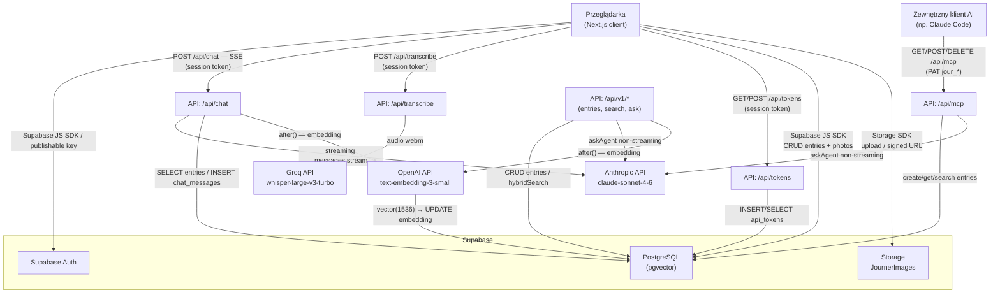

# Architektura systemu Journer

> Wygenerowano: 2026-06-15

## Przegląd systemu

Journer to aplikacja webowa do codziennego journalingu. Użytkownik zapisuje dzienne wpisy tekstowe z oceną nastroju, może dołączać zdjęcia i nagrania głosowe. System udostępnia agenta AI w osobie Ryana Holidaya (popularyzatora filozofii stoickiej), który prowadzi dialog w kontekście aktualnego wpisu i historii dziennika, korzystając z wyszukiwania hybrydowego. Aplikacja wystawia również endpoint MCP (Model Context Protocol), pozwalający zewnętrznym klientom AI (np. Claude Code) czytać i pisać dziennik przez standardowy protokół narzędziowy. Całość działa na Next.js 16 (App Router) z backendem Supabase i jest hostowana na Vercel.

---

## Diagram architektury

---

## Komponenty

### Frontend (client-side)

| Moduł | Odpowiedzialność | Technologia |
|---|---|---|
| `(auth)` route group | Strony logowania i rejestracji | Supabase Auth JS |
| `(app)` route group | Chronione przez `AuthGuard`; wymaga aktywnej sesji | Next.js App Router |
| `/journal` | Lista wpisów posortowana od najnowszego | React, `useEntries` hook |
| `/journal/[id]` | Szczegóły i edycja wpisu + panel czatu | Tiptap, `ChatPanel` |
| `/settings` | Ustawienia użytkownika (PAT, profil) | React |
| `/docs` | Interaktywna dokumentacja API v1 i MCP | Statyczna strona React |
| `TiptapEditor` | Edytor WYSIWYG (bold, italic, listy) | Tiptap 3 (ProseMirror) |
| `VoiceRecorder` | Nagrywanie audio → transkrypcja → wstawienie do edytora | Web Audio API |
| `ChatPanel` | Czat z agentem Ryan Holiday; odbiera SSE | React, fetch streaming |
| `PhotoStrip` | Galeria zdjęć, upload i usuwanie | Supabase Storage SDK |
| `MoodSelector` | Wybór nastroju w skali 1–5 | React |
| `AuthGuard` | Sprawdza sesję, przekierowuje do `/login` | `useAuth` hook |

### Warstwa biblioteczna (`src/lib/`)

| Plik | Odpowiedzialność |
|---|---|
| `supabase.ts` | Klient Supabase z publishable key (`sb_publishable_*`) — używany po stronie klienta |
| `supabase-admin.ts` | Klient Supabase z secret key (`sb_secret_*`) — używany wyłącznie po stronie serwera |
| `db.ts` | CRUD na tabeli `entries` wywoływany z hooków client-side |
| `journal-ops.ts` | Logika serwera: `hybridSearch`, `createOrUpdateEntry`, `getEntry`, `askAgent` |
| `chat-agent.ts` | Pętla agenta non-streaming; definicja narzędzia `get_entry` |
| `chatSystemPrompt.ts` | Buduje system prompt persona Ryana Holidaya |
| `embeddings.ts` | Generuje embeddingi przez OpenAI `text-embedding-3-small` |
| `api-auth.ts` | Walidacja PAT: format `jour_*`, lookup SHA-256 w `api_tokens` |
| `photos.ts` | Upload, usuwanie i signed URL dla zdjęć w Supabase Storage |
| `storage.ts` | Adapter localStorage (pozostałość z Fazy 1) |

### API Routes

| Endpoint | Metoda | Uwierzytelnienie | Opis |
|---|---|---|---|
| `/api/chat` | POST | session token (publishable key) | Streaming SSE — agent Ryan Holiday z pętlą tool_use |
| `/api/transcribe` | POST | session token (publishable key) | Audio webm → tekst przez Groq Whisper |
| `/api/tokens` | GET, POST | session token (publishable key) | Lista i tworzenie Personal Access Tokens |
| `/api/tokens/[id]` | DELETE | session token (publishable key) | Usuwanie PAT |
| `/api/mcp` | GET, POST, DELETE | PAT | Endpoint MCP (Streamable HTTP transport) |
| `/api/v1/entries` | POST | PAT | Utwórz lub zaktualizuj wpis |
| `/api/v1/entries/[date]` | GET | PAT | Pobierz wpis po dacie (YYYY-MM-DD) |
| `/api/v1/search` | POST | PAT | Wyszukiwanie hybrydowe |
| `/api/v1/ask` | POST | PAT | Zapytaj agenta (bez streamingu) |

---

## Źródła danych

### Supabase PostgreSQL

| Tabela | Co przechowuje | Uwagi |
|---|---|---|
| `entries` | Wpisy dziennika: `id` UUID, `user_id`, `date` (YYYY-MM-DD), `title`, `body` (HTML), `mood` (1–5), `created_at`, `updated_at`, `embedding` vector(1536). Constraint: `unique(user_id, date)`. | RLS: każdy widzi tylko swoje. Klient używa publishable key; serwer używa secret key. |
| `chat_messages` | Historia czatu z agentem: `id`, `user_id`, `role` (user/assistant), `content`, `created_at`. Brak kolumny entry_id — historia jest globalna dla użytkownika. | Cała historia ładowana chronologicznie jako kontekst agenta. |
| `api_tokens` | Personal Access Tokens: `id`, `user_id`, `token_hash` (SHA-256), `name`, `created_at`, `last_used_at`. | Lookup po hashu przy każdym żądaniu PAT. |
| `entry_photos` | Metadane zdjęć: `id`, `user_id`, `date`, `storage_path`, `created_at`. Indeks na `(user_id, date)`. | Zdjęcia serwowane przez Supabase Storage signed URL (TTL 3600s). |

### Indeksy wyszukiwania

| Indeks | Typ | Na czym |
|---|---|---|
| `entries_embedding_hnsw_idx` | HNSW (cosine) | `entries.embedding` — wyszukiwanie wektorowe |
| `entries_fts_idx` | GIN / tsvector | date + title + body (HTML stripped), słownik `simple` — FTS po polsku i angielsku |

### Supabase Storage

Bucket **`JournerImages`** (prywatny). Ścieżka pliku: `{user_id}/{date}/{uuid}.{ext}`. Dostęp przez signed URLs generowane na żądanie.

---

## Integracje i połączenia

| Serwis zewnętrzny | Kierunek | Model / endpoint | Uwierzytelnienie |
|---|---|---|---|
| **Anthropic API** | wychodzący | `claude-sonnet-4-6`, `/v1/messages` | `ANTHROPIC_API_KEY` (server-side env) |
| **OpenAI API** | wychodzący | `text-embedding-3-small`, `/v1/embeddings` | `OPENAI_API_KEY` (server-side env) |
| **Groq API** | wychodzący | `whisper-large-v3-turbo`, `/openai/v1/audio/transcriptions` | `GROQ_API_KEY` (server-side env) |
| **Supabase** | obie strony | REST + JS SDK, Storage | `NEXT_PUBLIC_SUPABASE_URL` + `NEXT_PUBLIC_SUPABASE_PUBLISHABLE_KEY` `sb_publishable_*` (klient) + `SUPABASE_SECRET_KEY` `sb_secret_*` (serwer) |
| **Zewnętrzny klient MCP** | przychodzący | `/api/mcp` Streamable HTTP | PAT `jour_*` w nagłówku `Authorization: Bearer` |

### Zmienne środowiskowe

| Zmienna | Rola | Widoczność |
|---|---|---|
| `NEXT_PUBLIC_SUPABASE_URL` | URL projektu Supabase | publiczna (client + server) |
| `NEXT_PUBLIC_SUPABASE_PUBLISHABLE_KEY` | Publishable key Supabase (`sb_publishable_*`); bezpieczny w przeglądarce gdy włączone RLS | publiczna (client + server) |
| `SUPABASE_SECRET_KEY` | Secret key Supabase (`sb_secret_*`) — uprzywilejowany dostęp, omija RLS | tylko server |
| `ANTHROPIC_API_KEY` | Klucz Anthropic API | tylko server |
| `GROQ_API_KEY` | Klucz Groq API | tylko server |
| `OPENAI_API_KEY` | Klucz OpenAI API | tylko server |

---

## Przepływ danych

### Zapis wpisu (przeglądarka → Supabase)

1. Użytkownik edytuje wpis w Tiptap i wybiera nastrój.
2. *(Opcjonalnie)* Nagrywa głos → `POST /api/transcribe` → Groq Whisper → tekst trafia do edytora.
3. Kliknięcie „Zapisz": `useEntries.saveEntry()` → `db.createEntry/updateEntry` → Supabase `entries` (anon key, RLS).
4. Asynchronicznie po zapisie (`next/server after()`): serwer generuje embedding przez OpenAI i aktualizuje kolumnę `entries.embedding`.

### Czat z agentem Ryan Holiday (SSE)

1. Użytkownik wpisuje wiadomość w `ChatPanel`.
2. `POST /api/chat` — body: wiadomość + kontekst wpisu + Supabase access token.
3. Serwer waliduje JWT Supabase (`auth.getUser`).
4. Serwer ładuje historię z `chat_messages`.
5. Serwer uruchamia `hybridSearch` — równolegle: wyszukiwanie wektorowe + FTS + ostatnie 7 dni.
6. Budowany jest system prompt (persona Ryana Holidaya + treść wpisu + wyniki wyszukiwania).
7. Wywołanie Anthropic API w trybie streaming; fragmenty tekstu przesyłane jako SSE `data: {"text": "..."}`.
8. Jeśli model wywołuje narzędzie `get_entry(date)`, pętla pobiera wpis z Supabase i kontynuuje (maks. 5 iteracji).
9. Po zakończeniu strumienia: `after()` zapisuje parę {user, assistant} do `chat_messages`.

### Dostęp przez API v1 / MCP (zewnętrzny klient)

1. Klient wysyła `Authorization: Bearer jour_<token>`.
2. `validatePAT` oblicza SHA-256 tokenu, szuka w `api_tokens`; zwraca `user_id` lub 401.
3. Operacje na danych przez `journal-ops.ts` z klientem service role (omija RLS).
4. `POST /api/v1/ask` i narzędzie `ask` w MCP uruchamiają `askAgent` — ta sama logika co czat, lecz bez streamingu.

### MCP (Streamable HTTP)

Endpoint `/api/mcp` tworzy instancję `McpServer` (SDK `@modelcontextprotocol/sdk`) z czterema narzędziami:
- `create_entry` — utwórz lub zaktualizuj wpis
- `get_entry` — odczytaj wpis po dacie
- `search_entries` — hybrid search
- `ask` — zapytaj agenta Ryana Holidaya

---

## Hosting i deployment

| Aspekt | Szczegół |
|---|---|
| Platforma | Vercel |
| Gałąź `master` | Production deployment |
| Gałąź `sandbox` | Preview deployment (Vercel Preview URL) |
| Runtime API | Node.js (wszystkie trasy mają `export const runtime = "nodejs"`) |
| Limit czasu MCP | `maxDuration = 60s` (Vercel Functions) |
| Start lokalny | `npm run dev` lub `start-dev.cmd` |
| Backfill embeddingów | `node scripts/generate-embeddings.mjs` (jednorazowy skrypt, rate-limited do ~300 RPM) |

---

## Otwarte pytania / TODO

- `src/lib/storage.ts` (adapter localStorage z Fazy 1) pozostaje w kodzie — [do weryfikacji: czy jest nadal importowany, czy można usunąć]
- Historia `chat_messages` jest globalna dla użytkownika (bez powiązania z konkretnym wpisem po usunięciu `entry_id`) — [do weryfikacji: czy interfejs poprawnie filtruje lub prezentuje rozmowy]
- Brak mechanizmu czyszczenia lub stronicowania `chat_messages` — tabela może rosnąć bez ograniczeń
- `OPENAI_API_KEY` jest wymagany do wyszukiwania wektorowego; jeśli brakuje, hybrid search działa tylko przez FTS + recent — [do weryfikacji: czy to akceptowalne zachowanie]
- Typ uwierzytelnienia Supabase Auth (email/password vs. OAuth) — [do weryfikacji w panelu Supabase]
- Brak rate limitingu dla `/api/v1/*` i `/api/mcp` — [do weryfikacji]
