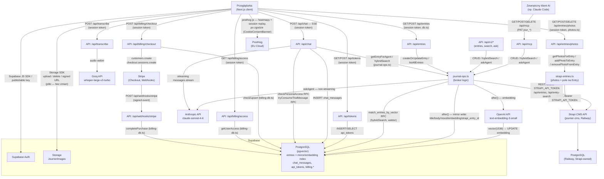

# Architektura systemu Journer

> Wygenerowano: 2026-06-15 (zaktualizowano: 2026-07-29 — RRF (Reciprocal Rank Fusion) dla `hybridSearch`; PostHog: heatmapy + session replay za zgodą użytkownika (cookie consent), treść wpisów/czatu maskowana klasą `.ph-mask`; usunięcie martwej `increment_trial_usage` RPC + uporządkowanie sekcji billingu; przeprowadzony audyt bezpieczeństwa — patrz sekcja „Bezpieczeństwo". Wcześniej 2026-07-28: migracja treści wpisów do Strapi/Railway; Supabase zostaje przy auth/embeddingach/czacie/billingu; linki do zdjęć przeniesione do Strapi, `mood` opcjonalny. Tego samego dnia, później: naprawiony realny bug płatności premium person — patrz „Uwaga operacyjna" w sekcji „Flow zakupu premium persony" i wpis w „Otwarte pytania / TODO")

## Przegląd systemu

Journer to aplikacja webowa do codziennego journalingu. Użytkownik zapisuje dzienne wpisy tekstowe z oceną nastroju, może dołączać zdjęcia i nagrania głosowe. System udostępnia agentów AI w trzech osobach: Ryan Holiday (darmowy), Carl Jung i Alan Watts (premium, jednorazowy zakup przez Stripe). Agenci prowadzą dialog w kontekście aktualnego wpisu i historii dziennika, korzystając z wyszukiwania hybrydowego rankingowanego przez Reciprocal Rank Fusion. Historia czatu jest izolowana per persona. Aplikacja wystawia również endpoint MCP (Model Context Protocol), pozwalający zewnętrznym klientom AI (np. Claude Code) czytać i pisać dziennik przez standardowy protokół narzędziowy. Całość działa na Next.js 16 (App Router), hostowana na Vercel.

Treść wpisów (`title`/`body`/`date`/`mood`) ma źródło prawdy w **self-hosted Strapi CMS** (Railway, osobne repo `journer-cms`) — Next.js jest jedynym brokerem, przeglądarka nigdy nie rozmawia ze Strapi bezpośrednio. **Supabase** zostaje przy: auth, embeddingach wektorowych (powiązanych ze Strapi przez `entries.strapi_entry_id`), historii czatu i billingu.

---

## Diagram architektury

```mermaid
graph TD
    Browser["Przeglądarka\n(Next.js client)"]
    ExternalAI["Zewnętrzny klient AI\n(np. Claude Code)"]
    StripeService["Stripe\n(Checkout, Webhooks)"]

    Browser -->|"Supabase JS SDK / publishable key"| SupaAuth["Supabase Auth"]
    Browser -->|"POST /api/chat — SSE\n(session token)"| ChatRoute["API: /api/chat"]
    Browser -->|"POST /api/transcribe\n(session token)"| TranscribeRoute["API: /api/transcribe"]
    Browser -->|"GET/POST /api/tokens\n(session token)"| TokensRoute["API: /api/tokens"]
    Browser -->|"GET /api/billing/access\n(session token)"| BillingAccessRoute["API: /api/billing/access"]
    Browser -->|"POST /api/billing/checkout\n(session token)"| BillingCheckoutRoute["API: /api/billing/checkout"]
    Browser -->|"GET/POST /api/entries\n(session token, db.ts)"| EntriesRoute["API: /api/entries"]
    Browser -->|"GET/POST/DELETE /api/entries/photos\n(session token, photos.ts)"| PhotosRoute["API: /api/entries/photos"]
    Browser -->|"Storage SDK\nupload / delete / signed URL\n(pliki — bez zmian)"| SupaStorage
    Browser -->|"posthog-js — heatmapy + session replay,\npo zgodzie (CookieConsentBanner)"| PostHogService["PostHog\n(EU Cloud)"]

    ExternalAI -->|"GET/POST/DELETE /api/mcp\n(PAT jour_*)"| MCPRoute["API: /api/mcp"]

    BillingCheckoutRoute -->|"customers.create\ncheckout.sessions.create"| StripeService
    StripeService -->|"POST /api/webhooks/stripe\n(signed event)"| WebhookRoute["API: /api/webhooks/stripe"]
    WebhookRoute -->|"completePurchase (billing-db.ts)"| SupaDB

    BillingAccessRoute -->|"getUserAccess (billing-db.ts)"| SupaDB
    BillingCheckoutRoute -->|"check/upsert (billing-db.ts)"| SupaDB

    ChatRoute -->|"checkPersonaAccess RPC\ntryConsumeTrialMessage RPC"| SupaDB
    ChatRoute -->|"streaming messages.stream"| AnthropicAPI["Anthropic API\nclaude-sonnet-4-6"]
    ChatRoute -->|"INSERT chat_messages"| SupaDB
    ChatRoute -->|"getEntryForAgent / hybridSearch\n(journal-ops.ts)"| JournalOps["journal-ops.ts\n(broker logic)"]

    TranscribeRoute -->|"audio webm"| GroqAPI["Groq API\nwhisper-large-v3-turbo"]

    TokensRoute -->|"INSERT/SELECT api_tokens"| SupaDB

    EntriesRoute -->|"createOrUpdateEntry / listAllEntries"| JournalOps
    PhotosRoute -->|"getPhotosForEntry / addPhotoToEntry\n/ removePhotoFromEntry"| StrapiEntries["strapi-entries.ts\n(photos = pole na Entry)"]
    StrapiEntries -->|"REST, Bearer STRAPI_API_TOKEN"| StrapiAPI

    V1Routes["API: /api/v1/*\n(entries, search, ask)"]
    V1Routes -->|"CRUD / hybridSearch / askAgent"| JournalOps
    MCPRoute -->|"CRUD / hybridSearch / askAgent"| JournalOps

    JournalOps -->|"REST, Bearer STRAPI_API_TOKEN\n/api/entries, /api/entry-search"| StrapiAPI["Strapi CMS API\n(journer-cms, Railway)"]
    JournalOps -->|"askAgent — non-streaming"| AnthropicAPI
    JournalOps -->|"match_entries_by_vector RPC\n(hybridSearch, wektor)"| SupaDB
    JournalOps -->|"after() — mirror write:\ntitle/body/mood/embedding/strapi_entry_id"| SupaDB
    JournalOps -->|"after() — embedding"| OpenAIAPI["OpenAI API\ntext-embedding-3-small"]

    StrapiAPI --> StrapiPG["PostgreSQL\n(Railway, Strapi-owned)"]

    subgraph Supabase
        SupaAuth
        SupaDB["PostgreSQL\n(pgvector)\nentries = mirror/embedding index\nchat_messages, api_tokens, billing.*"]
        SupaStorage["Storage\nJournerImages"]
    end

    OpenAIAPI -->|"vector(1536) → UPDATE embedding"| SupaDB
```

---

## Komponenty

### Frontend (client-side)

| Moduł | Odpowiedzialność | Technologia |
|---|---|---|
| `(auth)` route group | Strony logowania i rejestracji | Supabase Auth JS |
| `(app)` route group | Chronione przez `AuthGuard`; wymaga aktywnej sesji | Next.js App Router |
| `/journal` | Lista wpisów posortowana od najnowszego | React, `useEntries` hook |
| `/journal/[date]` | Szczegóły i edycja wpisu (klucz: data `YYYY-MM-DD`, nie UUID) + panel czatu | Tiptap, `ChatPanel` |
| `/calendar` | Miesięczny widok kalendarza — nawigacja Poprzedni/Następny miesiąc; klikalne dni z wpisem prowadzą do `/journal/[date]`; dni z aktywnością oznaczone kropką na podstawie samych wpisów (zdjęcie zawsze implikuje istnienie wpisu — patrz niżej) | React, `useEntries` |
| `/agent` | Samodzielna strona agenta AI bez edytora — kontekst z dzisiejszego wpisu (lub ostatniego dostępnego); identyczny `ChatPanel` jak w widoku wpisu | React, `dynamic` import `ChatPanel` |
| `/settings` | Ustawienia użytkownika (PAT, profil) | React |
| `/docs` | Interaktywna dokumentacja API v1 i MCP | Statyczna strona React |
| `TiptapEditor` | Edytor WYSIWYG (bold, italic, listy) — treść i podgląd owinięte klasą `.ph-mask` (maskowanie w PostHog session replay) | Tiptap 3 (ProseMirror) |
| `VoiceRecorder` | Nagrywanie audio → transkrypcja → wstawienie do edytora | Web Audio API |
| `ChatPanel` | Czat z wybranym agentem; odbiera SSE; fetchuje stan dostępu do premium person (po powrocie z checkoutu Stripe: polling do 6× co 1.5s, nie jednorazowy fetch — webhook bywa opóźniony względem redirectu, patrz „Uwaga operacyjna" niżej); obsługuje flow zakupu; treść wiadomości owinięta `.ph-mask` | React, fetch streaming |
| `PersonaSelector` | Wybór persony; dynamiczny stan locked/unlocked z `/api/billing/access` | React |
| `PersonaUpgradeModal` | Modal z info o trialu i przyciskiem zakupu Stripe | React |
| `PhotoStrip` | Galeria zdjęć, upload i usuwanie | Supabase Storage SDK (pliki) + broker `/api/entries/photos` (linki) |
| `MoodSelector` | Wybór nastroju w skali 1–5 | React |
| `BottomNav` | Dolna nawigacja — przełączanie między Wpisem (`/journal`), Kalendarzem (`/calendar`) i Agentem (`/agent`); layout `(app)` ma `pb-20` zapobiegające przykryciu treści | React |
| `AuthGuard` | Sprawdza sesję, przekierowuje do `/login` | `useAuth` hook |
| `CookieConsentBanner` | Banner zgody (Akceptuję/Odrzuć), renderowany w root `layout.tsx`; dopóki user nie zaakceptuje, PostHog w ogóle się nie ładuje (nie tylko capture jest wyłączony) | React, `posthog-client.ts` |

### Warstwa biblioteczna (`src/lib/`)

| Plik | Odpowiedzialność |
|---|---|
| `supabase.ts` | Klient Supabase z publishable key — używany po stronie klienta |
| `supabase-admin.ts` | Klient Supabase z secret key — używany wyłącznie po stronie serwera |
| `strapi.ts` | Niskopoziomowy HTTP klient do Strapi: `strapiFetch()`, rzuca błąd od razu gdy brakuje `STRAPI_API_URL`/`STRAPI_API_TOKEN` (jak `getStripe()`), zawsze `cache: "no-store"`; typowany `StrapiError` na non-2xx |
| `strapi-entries.ts` | Operacje CRUD/search na wpisach w Strapi: `findEntryByUserAndDate`, `listAllEntries`, `createStrapiEntry`, `updateStrapiEntry`, `listRecentEntries`, `searchEntriesFullText`, `findEntriesByStrapiIds`, plus wspólna `getEntryForAgent` (zastąpiła 3 wcześniejsze duplikaty fetchowania wpisu dla agenta). Osobno: `getPhotosForEntry`/`addPhotoToEntry`/`removePhotoFromEntry` — operują na polu `photos` (JSON, ścieżki Supabase Storage) na encji `Entry`; find-or-create przy pierwszym zdjęciu. `photos` jest celowo tylko wewnętrzne — nie wchodzi do publicznego typu `StrapiEntry`/`Entry`, nic poza tymi funkcjami tego nie potrzebuje |
| `db.ts` | Cienki fetch-klient `/api/entries` (GET/POST z Bearer session token) używany z hooków client-side — **nie** rozmawia z Supabase/Strapi bezpośrednio |
| `api-session.ts` | Współdzielony helper: Bearer session token → user-scoped klient Supabase → `auth.getUser()`. Używany przez `/api/entries` i `/api/entries/photos` |
| `journal-ops.ts` | Centralny broker: `hybridSearch`, `createOrUpdateEntry`, `getEntry`, `askAgent`, `buildSearchContext`. `hybridSearch` rankinguje wyniki przez RRF (Reciprocal Rank Fusion, k=60 — Elasticsearch/Azure default) po trzech nogach (vector/text/recent): `score = Σ 1/(k + rank)`. Czyta/pisze treść wpisu przez `strapi-entries.ts`; po zapisie w tle (`after()`) utrzymuje w Supabase `entries` kopię-lustro (`title`/`body`/`mood`/`embedding`/`strapi_entry_id`) pod wyszukiwanie wektorowe. `mood` opcjonalny (`number | null`) — wpis "tylko ze zdjęciami" bez tekstu/nastroju jest stanem legalnym |
| `chat-agent.ts` | Pętla agenta non-streaming; definicja narzędzia `get_entry` (implementację fetchowania wpisu dostaje jako callback od wywołującego) |
| `chatSystemPrompt.ts` | Buduje system prompt wybranej persony (Ryan / Jung / Watts) |
| `personas.ts` | Konfiguracja trzech person: `ryan` (unlocked), `jung`, `watts` (premium) |
| `billing.ts` | Logika billingowa: `getUserAccess`, `checkPersonaAccess`, `tryConsumeTrialMessage`, lazy `getStripe()` |
| `billing-db.ts` | Niskopoziomowe operacje billing przez admin client: bezpośrednie zapytania `.schema("billing")` (nie RPC — patrz „Funkcje SQL" niżej) |
| `embeddings.ts` | Generuje embeddingi przez OpenAI `text-embedding-3-small` |
| `api-auth.ts` | Walidacja PAT: format `jour_*`, lookup SHA-256 w `api_tokens` |
| `photos.ts` | Upload/usuwanie/signed URL — pliki idą bezpośrednio do Supabase Storage (klient, RLS, bez zmian od zawsze); metadanę (który storage path należy do której daty) synchronizuje przez broker `/api/entries/photos`, bo tylko serwer ma `STRAPI_API_TOKEN` |
| `storage.ts` | Adapter localStorage (pozostałość z Fazy 1) |
| `posthog-client.ts` | `initAnalytics()` — inicjalizuje `posthog-js` (autocapture wyłączony, `capture_heatmaps: true`, `enable_recording_console_log: false`, `defaults: '2026-06-25'`); `getConsentChoice()`/`setConsentChoice()` — stan zgody w `localStorage`. Idempotentne (moduł pilnuje żeby `init()` nie odpalił się dwa razy) |

### API Routes

| Endpoint | Metoda | Uwierzytelnienie | Opis |
|---|---|---|---|
| `/api/chat` | POST | session token | Streaming SSE — wybrany agent (Ryan/Jung/Watts) z pętlą tool_use; sprawdza dostęp do premium person |
| `/api/billing/access` | GET | session token | Zwraca stan dostępu i trial dla premium person (`{ jung: { unlocked, trialRemaining }, watts: ... }`) |
| `/api/billing/checkout` | POST | session token | Tworzy Stripe Checkout Session; zapisuje pending purchase; zwraca `checkoutUrl` |
| `/api/webhooks/stripe` | POST | Stripe signature | Odbiera eventy Stripe; `checkout.session.completed` → markuje purchase jako completed |
| `/api/transcribe` | POST | session token | Audio webm → tekst przez Groq Whisper |
| `/api/tokens` | GET, POST | session token | Lista i tworzenie Personal Access Tokens |
| `/api/tokens/[id]` | DELETE | session token | Usuwanie PAT |
| `/api/entries` | GET, POST | session token | Broker dla przeglądarki: lista wszystkich wpisów / utwórz-lub-zaktualizuj wpis. Deleguje do `journal-ops.ts` (`listAllEntries`/`createOrUpdateEntry`) — ta sama logika co PAT/MCP. Zastąpił bezpośrednie zapisy przeglądarki do Supabase |
| `/api/entries/photos` | GET, POST, DELETE | session token | Linkuje/odlinkowuje storage path ze zdjęciem do wpisu o danej dacie (find-or-create). GET zwraca `{photos}` dla daty; POST/DELETE wymagają, żeby `storagePath` zaczynał się od `{callerUserId}/` (obrona w głąb — RLS Storage i tak by to wyłapało, ale sprawdzane też tu) |
| `/api/mcp` | GET, POST, DELETE | PAT | Endpoint MCP (Streamable HTTP transport); używa wyłącznie persony Ryan (darmowej) |
| `/api/v1/entries` | POST | PAT | Utwórz lub zaktualizuj wpis |
| `/api/v1/entries/[date]` | GET | PAT | Pobierz wpis po dacie (YYYY-MM-DD) |
| `/api/v1/search` | POST | PAT | Wyszukiwanie hybrydowe |
| `/api/v1/ask` | POST | PAT | Zapytaj agenta (bez streamingu) |

> **Uwaga dot. uwierzytelnienia:** Endpointy `/api/billing/*`, `/api/entries`, `/api/entries/photos` i `/api/webhooks/stripe` nie obsługują PAT — tylko session token (są wewnętrzne dla UI, wołane z `db.ts`/`photos.ts`/klienckich hooków). Zdjęcia nie mają odpowiednika w `/api/v1/*`/MCP — to funkcja tylko przeglądarki.
>
> **Uwaga:** `/api/v1/*` i `/api/mcp` importują wyłącznie z `journal-ops.ts`/`api-auth.ts` — podział Strapi/Supabase jest w pełni ukryty wewnątrz brokera, niewidoczny dla tych route handlerów.
>
> **Uwaga:** żaden z powyższych endpointów nie akceptuje `user_id` z body/query — zawsze pochodzi z `auth.getUser()` (session token) lub `validatePAT()` (PAT lookup w DB). Zweryfikowane w audycie bezpieczeństwa 2026-07-29 dla całej listy powyżej, w tym nowszych `/api/entries`, `/api/entries/photos` — patrz sekcja „Bezpieczeństwo".

---

## Źródła danych

### Strapi CMS (`journer-cms`, Railway) — źródło prawdy dla treści wpisów

Osobne repo (`C:\Users\kamij\journer-cms`, GitHub: `kamiljurek13-jpg/journer-cms`, private), własna instancja Postgres na Railway (jeden wspólny serwis, bez podziału sandbox/prod). Auto-deploy: `git push` → Railway buduje i wdraża automatycznie (serwis `strapi` podłączony do GitHub repo/brancha `master`; wcześniej był ręczny `railway up`).

| Element | Szczegół |
|---|---|
| Content-type `Entry` | `journer-cms/src/api/entry/` — pola: `user_id` (Text, zwykły string, **brak** relacji do Strapi Users & Permissions), `date` (Text, `YYYY-MM-DD`), `title` (Text, opcjonalne), `body` (Text long — surowy HTML z Tiptap, nie rich-text Blocks), `mood` (Number, 1–5, **opcjonalny** — wpis może istnieć tylko ze zdjęciami), `photos` (JSON, opcjonalne — tablica ścieżek Supabase Storage; **nigdy** signed URL ani bajty pliku, tylko stabilne ścieżki). Draft & Publish wyłączone |
| Unikalność `(user_id, date)` | Dwie warstwy: lifecycle hook `beforeCreate`/`beforeUpdate` + realny unique index w bazie |
| Pełnotekstowe wyszukiwanie | Własny GIN/tsvector index (`entries_fts_idx`, słownik `simple`) tworzony w `bootstrap()` (`journer-cms/src/index.ts`) — **nie** jako `database/migrations/*.sql`, bo migracje Strapi uruchamiają się przed sync tabel content-type i failowałyby na świeżej bazie |
| Search endpoint | `GET /api/entry-search` — custom, poza `/api/entries/*` (żeby nie kolidować z routingiem `:documentId`); odtwarza `ts_rank_cd`/`plainto_tsquery('simple', ...)`, filtrowany po `user_id` przekazanym z Next.js |
| API | REST v5 — kształt **płaski** (bez `data.attributes` jak w v4), identyfikator to `documentId` (string) |
| Autoryzacja | Token typu **Custom** (nie Full access), scoped do CRUD `Entry` + `entry-search`; Strapi nigdy nie zna pojęcia "zalogowany user" — cała autoryzacja dzieje się w Next.js przed wywołaniem |
| Publiczny URL | `https://strapi-production-a5e7.up.railway.app` |

### Supabase PostgreSQL — schemat `public`

| Tabela | Co przechowuje | Uwagi |
|---|---|---|
| `entries` | **Od migracji do Strapi (2026-07-28): kopia-lustro pod embedding, nie źródło prawdy.** `id` UUID, `user_id`, `date` (YYYY-MM-DD), `title`, `body` (HTML), `mood` (1–5, **nullable** od 2026-07-28), `created_at`, `updated_at`, `embedding` vector(1536), `strapi_entry_id` text (unique index `entries_strapi_entry_id_idx`, łączy wiersz z odpowiadającym dokumentem w Strapi). Constraint: `unique(user_id, date)`. Zapisywana asynchronicznie (`after()`) przez `journal-ops.ts` po każdym create/update w Strapi — `title`/`body` tu mogą się różnić od Strapi jeśli mirror-write jeszcze nie zdążył (rzadki wyścig, nieistotny bo te kolumny nie są już czytane do wyświetlania). Nie zawiera `photos` — ta informacja żyje wyłącznie w Strapi. | RLS: każdy widzi tylko swoje. `title`/`body` celowo jeszcze nie usunięte — to mechanizm rollbacku (Migracja B, patrz TODO). |
| `chat_messages` | Historia czatu z agentem: `id`, `user_id`, `role` (user/assistant), `content`, `persona` (ryan/jung/watts), `created_at`. | Historia izolowana per persona (filtr `.eq("persona", persona)` zarówno przy odczycie jak i zapisie). |
| `api_tokens` | Personal Access Tokens: `id`, `user_id`, `token_hash` (SHA-256), `name`, `created_at`, `last_used_at`. | Lookup po hashu przy każdym żądaniu PAT. |
| `entry_photos` | **Od 2026-07-28: nieużywana, zastąpiona polem `photos` na encji Strapi.** `id`, `user_id`, `date`, `storage_path`, `created_at`. | Celowo jeszcze nie zdropnięta (0 wierszy, ale ten sam ostrożny wzorzec co Migracja B) — czeka na wyraźną prośbę użytkownika. |

### Supabase PostgreSQL — schemat `billing`

Schemat niedostępny przez PostgREST (brak ekspozycji). Dostęp wyłącznie przez admin client (service_role) — bezpośrednie zapytania do schematu `billing` z pominięciem RLS (obrona głęboka: funkcje nie używają `SECURITY DEFINER`; atomowe operacje realizowane przez SQL RPC bez eskalacji uprawnień). RLS: deny-all na wszystkich tabelach.

| Tabela | Co przechowuje |
|---|---|
| `billing.customers` | Mapowanie `user_id → stripe_customer_id` |
| `billing.purchases` | Jednorazowe zakupy per user per persona: status (`pending`/`completed`/`refunded`), checkout session ID, payment intent ID, kwota |
| `billing.trial_usage` | Licznik wiadomości trialu per user per persona |

### Funkcje SQL (schemat `public`)

| Funkcja | Opis |
|---|---|
| `try_consume_trial_message(p_user_id, p_persona, p_limit)` | Atomowy check-and-consume trialu — zwraca `bool` (true = wiadomość zużyta, false = limit wyczerpany). Zapobiega wyścigowi TOCTOU. Jedyna pozostała funkcja RPC dla billingu. |

Pozostałe operacje billingowe (purchases/customers: check/upsert/complete) idą przez bezpośrednie `.schema("billing")` zapytania w `billing-db.ts`, **nie** przez RPC — sześć RPC-wrapperów (`check_existing_purchase`, `complete_purchase`, `get_stripe_customer_id`, `get_user_billing_access`, `upsert_pending_purchase`, `upsert_stripe_customer`) zostało usuniętych 2026-07-07 jako martwy, wykonywalny przez `anon`/`authenticated` kod (realny IDOR — `complete_purchase` pozwalało oznaczyć cudzy zakup jako opłacony, patrz `20260707120000_drop_orphaned_billing_rpc_functions.sql`). `increment_trial_usage` (zastąpiona przez `try_consume_trial_message`) usunięta analogicznie 2026-07-29 (`20260729120000_drop_orphaned_increment_trial_usage.sql`) — nie była już wtedy exploitowalna (SECURITY DEFINER zdjęty wcześniej), ale zostawała jako martwy kod.

### Indeksy wyszukiwania

| Indeks | Baza | Typ | Na czym |
|---|---|---|---|
| `entries_embedding_hnsw_idx` | Supabase | HNSW (cosine) | `entries.embedding` — wyszukiwanie wektorowe (`match_entries_by_vector` RPC, zwraca `strapi_entry_id`/`date`/`mood`/`similarity` — bez `title`/`body`, hydratowane ze Strapi w `hybridSearch`) |
| `entries_fts_idx` | **Strapi/Railway** (aktywny, obsługuje `GET /api/entry-search`) | GIN / tsvector | date + title + body (HTML stripped), słownik `simple` — FTS po polsku i angielsku |
| `entries_fts_idx` (ten sam identyfikator, inna baza) | Supabase — **osierocony** | GIN / tsvector | Sprzed migracji; nic już go nie odpytuje (FTS idzie przez Strapi), ale nieusunięty — czeka na Migrację B razem z `title`/`body` |

### Supabase Storage

Bucket **`JournerImages`** (prywatny). Ścieżka pliku: `{user_id}/{date}/{uuid}.{ext}`. Dostęp przez signed URLs generowane na żądanie. Upload/usuwanie/sign nadal client-direct (bez zmian, RLS `storage.objects` sprawdza pierwszy segment ścieżki = `auth.uid()`) — jedyna zmiana to gdzie *żyje link* do pliku (patrz Strapi `Entry.photos` wyżej), nie jak działa sam Storage.

---

## System person AI

| Persona | ID | Dostęp | Opis |
|---|---|---|---|
| Ryan Holiday | `ryan` | darmowy | Filozofia stoicka — praktyczne działanie |
| Carl Jung | `jung` | premium (10 PLN jednorazowo) | Analityczna psychologia — cień, archetypy |
| Alan Watts | `watts` | premium (10 PLN jednorazowo) | Zen & Taoizm — wschodnia mądrość |

**Trial:** 5 darmowych wiadomości per premium persona. Po wyczerpaniu trialu — paywall (Stripe Checkout).

**Egzekwowanie dostępu:** `/api/chat` sprawdza dostęp przed każdym żądaniem przez `checkPersonaAccess()`. Klient UI może pominąć blokadę UI, ale backend zawsze weryfikuje (zwraca 402 jeśli brak dostępu). Zweryfikowane live w audycie 2026-07-29: świeże konto dostaje 5 wiadomości trialu (nie natychmiastową odmowę — to zamierzone), 6. próba poprawnie zwraca odmowę; webhook Stripe → `/api/billing/access` widzi odblokowanie natychmiast (bez cache) **pod warunkiem, że webhook faktycznie doszedł** — patrz incydent w „Flow zakupu premium persony" niżej.

---

## Integracje i połączenia

| Serwis zewnętrzny | Kierunek | Model / endpoint | Uwierzytelnienie |
|---|---|---|---|
| **Anthropic API** | wychodzący | `claude-sonnet-4-6`, `/v1/messages` | `ANTHROPIC_API_KEY` (server-side env) |
| **OpenAI API** | wychodzący | `text-embedding-3-small`, `/v1/embeddings` | `OPENAI_API_KEY` (server-side env) |
| **Groq API** | wychodzący | `whisper-large-v3-turbo`, `/openai/v1/audio/transcriptions` | `GROQ_API_KEY` (server-side env) |
| **Stripe API** | wychodzący | Checkout Sessions, Customers | `STRIPE_SECRET_KEY` (server-side env) |
| **Stripe Webhooks** | przychodzący | `checkout.session.completed` → `/api/webhooks/stripe` | Stripe signature (`STRIPE_WEBHOOK_SECRET`) |
| **Supabase** | obie strony | REST + JS SDK, Storage | `NEXT_PUBLIC_SUPABASE_PUBLISHABLE_KEY` (klient) + `SUPABASE_SECRET_KEY` (serwer) |
| **Strapi CMS** (`journer-cms`, Railway) | wychodzący | REST v5, `/api/entries`, `/api/entry-search` | `STRAPI_API_TOKEN` (Custom scope, server-only) — patrz `src/lib/strapi.ts` |
| **Zewnętrzny klient MCP** | przychodzący | `/api/mcp` Streamable HTTP | PAT `jour_*` w nagłówku `Authorization: Bearer` |
| **PostHog** (EU Cloud) | wychodzący | Heatmapy + session replay, klient `posthog-js` (`src/lib/posthog-client.ts`) | `NEXT_PUBLIC_POSTHOG_PROJECT_TOKEN` (klient) — ładowany dopiero po zgodzie w `CookieConsentBanner`; autocapture wyłączony, treść wpisów/czatu maskowana klasą `.ph-mask` (domyślny `maskTextClass` rrweb) |

### Zmienne środowiskowe

| Zmienna | Rola | Widoczność |
|---|---|---|
| `NEXT_PUBLIC_SUPABASE_URL` | URL projektu Supabase | publiczna |
| `NEXT_PUBLIC_SUPABASE_PUBLISHABLE_KEY` | Publishable key Supabase | publiczna |
| `SUPABASE_SECRET_KEY` | Secret key Supabase — omija RLS | tylko server |
| `ANTHROPIC_API_KEY` | Klucz Anthropic API | tylko server |
| `GROQ_API_KEY` | Klucz Groq API | tylko server |
| `OPENAI_API_KEY` | Klucz OpenAI API | tylko server |
| `STRIPE_SECRET_KEY` | Secret key Stripe | tylko server |
| `STRIPE_WEBHOOK_SECRET` | Signing secret do weryfikacji webhooków Stripe — **musi być przegenerowany i podmieniony w Vercelu za każdym razem, gdy zmienia się URL endpointu w Stripe Dashboardzie** (nowy endpoint = nowy secret); zmiana w Vercelu wymaga redeploya, żeby zadziałała na już wdrożonym środowisku | tylko server |
| `STRIPE_JUNG_PRICE_ID` | Stripe Price ID dla persony Jung | tylko server |
| `STRIPE_WATTS_PRICE_ID` | Stripe Price ID dla persony Watts | tylko server |
| `STRIPE_TRIAL_MESSAGE_LIMIT` | Liczba darmowych wiadomości trialu (domyślnie 5) | tylko server |
| `NEXT_PUBLIC_APP_URL` | Bazowy URL aplikacji (dla redirect URLs Stripe) — kod ucina trailing slash od 2026-07-29 (`.replace(/\/+$/, "")` w `checkout/route.ts`), bo wartość w Vercelu miała `/` na końcu i dawała podwójny slash w `success_url`/`cancel_url` (`//agent`) | publiczna |
| `STRAPI_API_URL` | URL wdrożonego Strapi (`https://strapi-production-a5e7.up.railway.app`) | tylko server |
| `STRAPI_API_TOKEN` | Token API Strapi (Custom scope: CRUD Entry + entry-search) | tylko server |
| `STRAPI_DATABASE_URL` | Bezpośrednie połączenie Postgres do bazy Strapi na Railway — **tylko** do jednorazowego `scripts/migrate-entries-to-strapi.mjs` (backfill `created_at`/`updated_at`), nieużywane przez działającą aplikację | tylko server, tylko lokalnie/skrypt |
| `NEXT_PUBLIC_POSTHOG_PROJECT_TOKEN` | Token projektu PostHog (EU Cloud) | publiczna |
| `NEXT_PUBLIC_POSTHOG_HOST` | Ingestion host PostHog (`https://eu.i.posthog.com`) | publiczna |

---

## Przepływ danych

### Zapis wpisu (przeglądarka → Strapi, przez broker Next.js)

1. Użytkownik edytuje wpis w Tiptap i wybiera nastrój.
2. *(Opcjonalnie)* Nagrywa głos → `POST /api/transcribe` → Groq Whisper → tekst trafia do edytora.
3. Kliknięcie „Zapisz": `useEntries.saveEntry()` → `db.saveEntryApi()` → `POST /api/entries` z `Authorization: Bearer <session token>` (przeglądarka **nie** pisze już bezpośrednio do Supabase).
4. `/api/entries` weryfikuje sesję (`auth.getUser()`) i woła `createOrUpdateEntry()` z `journal-ops.ts` — tę samą funkcję, której używają `/api/v1/entries` (PAT) i MCP.
5. `createOrUpdateEntry()` zapisuje treść wpisu w Strapi (`findEntryByUserAndDate` → `createStrapiEntry`/`updateStrapiEntry`), źródło prawdy dla `title`/`body`/`date`/`mood`.
6. Asynchronicznie po zapisie (`next/server after()`): serwer generuje embedding przez OpenAI **i** zapisuje kopię-lustro do Supabase `entries` (`title`/`body`/`mood`/`embedding`/`strapi_entry_id`) pod wyszukiwanie wektorowe.
7. To zamyka lukę sprzed migracji, gdzie zapisy z przeglądarki nigdy nie generowały embeddingu (bo szły bezpośrednio do Supabase, z pominięciem serwera) — teraz każdy zapis, niezależnie od źródła (przeglądarka/PAT/MCP), przechodzi przez ten sam broker i zawsze generuje embedding.

### Czat z agentem (SSE)

1. Użytkownik wybiera personę w `PersonaSelector` (stan dostępu z `/api/billing/access`).
2. Jeśli persona locked i brak trialu → `PersonaUpgradeModal` → Stripe Checkout.
3. Użytkownik wpisuje wiadomość w `ChatPanel`.
4. `POST /api/chat` — body: wiadomość + kontekst wpisu + session token + persona.
5. Serwer weryfikuje token przez `auth.getUser()`.
6. Serwer sprawdza dostęp do persony (`checkPersonaAccess`): purchased → OK; trial remaining → OK + atomowy consume (`tryConsumeTrialMessage`); denied → 402.
7. Serwer ładuje historię z `chat_messages` filtrując po `persona`.
8. Serwer uruchamia `hybridSearch` (ranking RRF).
9. Budowany jest system prompt wybranej persony + treść wpisu + wyniki wyszukiwania.
10. Wywołanie Anthropic API w trybie streaming; fragmenty tekstu przesyłane jako SSE.
11. Pętla tool_use: jeśli model wywołuje `get_entry(date)`, pobiera wpis i kontynuuje (maks. 5 iteracji).
12. Po zakończeniu strumienia: `after()` zapisuje parę {user, assistant} do `chat_messages` z polem `persona`.

### Flow zakupu premium persony

1. Użytkownik klika locked personę → `PersonaUpgradeModal` z info o trialu.
2. Kliknięcie „Kup dostęp" → `POST /api/billing/checkout` z `{ persona, accessToken, returnPath }`.
3. Serwer tworzy/pobiera Stripe customer, tworzy Checkout Session, zapisuje pending purchase przez `billing-db.ts` (bezpośrednie zapytanie, nie RPC).
4. Frontend przekierowuje do Stripe Checkout (`checkoutUrl`).
5. Po płatności → Stripe wywołuje `POST /api/webhooks/stripe` (signed event).
6. Webhook weryfikuje podpis, wywołuje `completePurchase` (`billing-db.ts`) → status = 'completed'.
7. Stripe przekierowuje użytkownika na `returnPath?purchase=success&persona=jung`.
8. `ChatPanel` wykrywa `?purchase=success` i pollinguje `/api/billing/access` (do 6 prób, co 1.5s) aż `unlocked: true` się pojawi — nie jednorazowy fetch. Webhook (krok 5–6) bywa wolniejszy niż redirect przeglądarki (krok 7), więc jednorazowy odczyt potrafił złapać jeszcze niezaktualizowany stan i zostawić kłódkę zablokowaną na stałe mimo udanej płatności.

**Uwaga operacyjna — realny incydent 2026-07-29:** poza wyścigiem opisanym w kroku 8, w produkcji endpoint webhooka w Stripe Dashboardzie był ustawiony na sam root domeny (`https://journer.vercel.app/`) zamiast `https://journer.vercel.app/api/webhooks/stripe`. Efekt: Stripe realnie dostawał `200 OK` (od zwykłej strony głównej Next.js, nie od handlera), więc dashboard Stripe wyglądał na "zdrowy" — ale `/api/webhooks/stripe` nigdy nie było wywoływane (zero logów w Vercelu), `completePurchase()` nigdy się nie uruchamiał, a `billing.purchases` zostawało w `status='pending'` na zawsze mimo `payment_status: "paid"` po stronie Stripe. **Wniosek: `200 OK` w Stripe Events/Webhooks dashboard nie dowodzi, że handler się wykonał — dowodzi tylko, że coś pod skonfigurowanym URL-em odpowiedziało 200.** Przy diagnozowaniu podobnych problemów zawsze weryfikować: (1) faktyczny URL destination w Stripe Dashboard, (2) czy w logach aplikacji jest wpis dla tej konkretnej ścieżki.

### Dostęp przez API v1 / MCP (zewnętrzny klient)

1. Klient wysyła `Authorization: Bearer jour_<token>`.
2. `validatePAT` oblicza SHA-256, szuka w `api_tokens` (Supabase, klient secret key); zwraca `user_id` lub 401.
3. Operacje przez `journal-ops.ts`: treść wpisu (create/get) idzie do Strapi, `hybridSearch` łączy wektor z Supabase (secret key) z FTS/recent ze Strapi.
4. MCP używa wyłącznie persony Ryan (darmowej) — brak obsługi premium person przez MCP.

---

## Bezpieczeństwo

Audyt przeprowadzony 2026-07-29 (styl OWASP: broken access control/IDOR, sekrety, dostęp do Strapi, bucket zdjęć, XSS, CSRF, open redirect, podatności zależności) — obejmuje cały kod aplikacji Next.js + konfigurację Supabase (RLS, `get_advisors`) + `npm audit`. **Nie obejmuje** kodu Strapi (`journer-cms`, osobne repo, poza zasięgiem tego audytu).

### Zweryfikowane jako bezpieczne

| Obszar | Ustalenie |
|---|---|
| IDOR / broken access control | Każdy endpoint (w tym nowsze `/api/entries`, `/api/entries/photos` z migracji Strapi) wyprowadza `user_id` wyłącznie z JWT (`auth.getUser()`) lub PAT lookup (`validatePAT`) — nigdy z body/query. Zweryfikowano całą listę route handlerów. |
| Sekrety | Brak twardo zakodowanych sekretów w śledzonych plikach (grep + historia gita — tylko `.env.example` z placeholderami). `.gitignore` poprawnie wyklucza `.env*` poza `.env.example`. Wszystkie klucze serwerowe (Supabase secret, Strapi token, Stripe, Groq, OpenAI, Anthropic) bez prefiksu `NEXT_PUBLIC_`, czytane tylko w plikach bez `"use client"`. |
| Dostęp do Strapi | `STRAPI_API_TOKEN` używany wyłącznie server-side (`strapi.ts`, nigdy w komponencie klienckim). Strapi nie zna pojęcia usera — każde zapytanie filtrowane po `user_id` po stronie Next.js, spójnie we wszystkich funkcjach `strapi-entries.ts`. Token typu Custom (nie Full access). |
| Bucket zdjęć (`JournerImages`) | Prywatny bucket + RLS na `storage.objects` wymusza pierwszy segment ścieżki = `auth.uid()` dla insert/select/delete — egzekwowane na poziomie Postgresa, nie tylko w kodzie appki. `/api/entries/photos` dodatkowo waliduje `storagePath` (musi zaczynać się od `{callerUserId}/`) jako obrona w głąb przy linkowaniu zdjęcia do wpisu w Strapi. |
| XSS | Brak `dangerouslySetInnerHTML` w kodzie. Tiptap używa tylko `StarterKit` (bez rozszerzenia Link) — treść parsowana przez schemat ProseMirror, nie surowe innerHTML; brak wektora `javascript:` href. |
| CSRF | Sesja Supabase w `localStorage`, token dołączany jawnie jako `Authorization: Bearer` — brak polegania na ambient cookies, więc klasyczny CSRF nie ma zastosowania. |
| Webhook Stripe | Weryfikacja podpisu (`stripe.webhooks.constructEvent`) przed przetworzeniem eventu. **Uwaga (2026-07-29):** poprawny podpis to za mało — sam URL endpointu też musi wskazywać na `/api/webhooks/stripe`, patrz incydent w „Flow zakupu premium persony". |
| Open redirect | `returnPath` w `/api/billing/checkout` walidowany do ścieżek względnych (`startsWith("/")`). |
| PAT | 256-bit losowe tokeny, hashowane SHA-256 w spoczynku (nigdy plaintext), revoke zawsze scoped do `user_id` właściciela. |
| Trial/billing atomowość | `try_consume_trial_message` — atomowy check-and-consume (`INSERT...ON CONFLICT...WHERE`), zweryfikowane live w transakcji z rollbackiem (bez efektów ubocznych na produkcji): 5× `true`, 6. próba → `false`. |
| CORS | Brak jawnie ustawianych nagłówków CORS na żadnym endpoincie — domyślnie same-origin only, brak ryzyka wildcard-reflection z credentials. |
| Admin client (service_role) | Nigdy nie używany przed sprawdzeniem autoryzacji — potwierdzone we wszystkich 7 plikach które go importują. |

### Znane luki / rekomendacje (nie exploit, ale do świadomej decyzji)

| # | Luka | Priorytet |
|---|---|---|
| 1 | Brak rate limitingu na `/api/v1/*` i `/api/mcp` | Średni — możliwy koszt-runaway (Anthropic/OpenAI/Groq spend) |
| 2 | `npm audit`: 10 podatności (7 high, 2 moderate, 1 low). Next.js sam ma kilka high (SSRF przez rewrites, ujawnienie endpointów Server Functions, DoS) — fix wymaga `npm audit fix --force` (podbija wersję Next.js). Celowo nie zrobione automatycznie: `AGENTS.md` ostrzega że to niestandardowy/zmodyfikowany build Next.js, więc bump wersji wymaga świadomej decyzji i testów, nie ślepego `--force` | Wysoki |
| 3 | `GET /api/entry-search` w Strapi (`ts_rank_cd`/`plainto_tsquery`) — kod żyje w osobnym repo `journer-cms`, nie zweryfikowany w tym audycie pod kątem SQL injection | Do zrobienia w osobnej sesji z dostępem do `journer-cms` |
| 4 | Supabase Auth: „Leaked Password Protection" wyłączone (advisor WARN — HaveIBeenPwned check) | Niski — jednorazowy toggle w dashboardzie |
| 5 | Kilka funkcji SQL (`match_entries_by_text`, `try_consume_trial_message`, `match_entries_by_vector`) ma mutable `search_path` (advisor WARN) | Niski — defense-in-depth, dopisać `SET search_path = public` |

**Historia poprzednich audytów:** IDOR zweryfikowany 2026-06-15 i ponownie 2026-07-28 (po dodaniu endpointów Strapi); 6 martwych RPC z `SECURITY DEFINER` usuniętych 2026-07-07 (realny IDOR — `complete_purchase` pozwalało oznaczyć cudzy zakup jako opłacony); `increment_trial_usage` (już nieexploitowalny po zdjęciu `SECURITY DEFINER`, ale martwy) usunięty 2026-07-29.

---

## Hosting i deployment

| Aspekt | Szczegół |
|---|---|
| Platforma (Next.js) | Vercel |
| Gałąź `master` | Production deployment |
| Gałąź `sandbox` | Preview deployment (stały alias brancha); **od 2026-07-29 fixy dotyczące Stripe checkout/redirect lądują bezpośrednio na `master`**, bo preview na `sandbox` po powrocie z Checkoutu i tak przekierowuje na URL produkcyjny (najpewniej `NEXT_PUBLIC_APP_URL` jest wspólny między środowiskami w Vercelu) — branch nie daje wiarygodnego testu tego flow |
| Runtime API | Node.js (`export const runtime = "nodejs"`) |
| Limit czasu MCP | `maxDuration = 60s` (Vercel Functions) |
| Start lokalny | `npm run dev` |
| Dev webhooks Stripe | `stripe listen --forward-to localhost:3000/api/webhooks/stripe` |
| Backfill embeddingów | `node scripts/generate-embeddings.mjs` |
| Platforma (Strapi CMS) | Railway — projekt `journer-cms` (osobne repo `C:\Users\kamij\journer-cms`, poza tym repo) |
| Deploy Strapi | Auto-deploy — `git push` do `kamiljurek13-jpg/journer-cms` (GitHub, private) buduje i wdraża przez podłączenie Railway↔GitHub App na serwisie `strapi` |
| Migracja treści (jednorazowa) | `node --env-file=.env.local scripts/migrate-entries-to-strapi.mjs` — idempotentna, wznawialna, log NDJSON |

---

## Otwarte pytania / TODO

- `src/lib/storage.ts` (adapter localStorage z Fazy 1) — [do weryfikacji: czy jest nadal importowany, czy można usunąć]
- Brak rate limitingu dla `/api/v1/*` i `/api/mcp` — potwierdzone w audycie 2026-07-29, patrz sekcja „Bezpieczeństwo"
- Brak mechanizmu czyszczenia lub stronicowania `chat_messages` — tabela może rosnąć bez ograniczeń
- `OPENAI_API_KEY` wymagany do wyszukiwania wektorowego; bez niego hybrid search działa tylko przez FTS + recent
- Stripe konto **świadomie i trwale w trybie sandbox/test** — Journer to projekt edukacyjny/portfolio, nie jest i nie będzie monetyzowany; brak planu przejścia na live mode (decyzja użytkownika, 2026-07-29)
- MCP nie obsługuje premium person (Jung, Watts) — potencjalna przyszła funkcjonalność
- **Migracja Supabase B (odłożona świadomie)**: po okresie karencji od cutoveru — rename `entries`→`entry_embeddings`, drop `title`/`body`/`entries_fts_idx` z Supabase (dziś celowo nietknięte, to jest cały mechanizm rollbacku). Nie robić bez wyraźnej prośby użytkownika.
- **Drop `entry_photos` (odłożone świadomie)**: 0 wierszy, zastąpiona przez pole `photos` w Strapi — bezpieczne do usunięcia w dowolnym momencie, ale nie robić bez wyraźnej prośby użytkownika (ten sam ostrożny wzorzec co Migracja B, mimo że stawka jest tu zerowa).
- **npm audit / dependency hygiene**: 7 podatności high-severity (w tym Next.js) — patrz sekcja „Bezpieczeństwo", punkt 2. Wymaga świadomej decyzji ze względu na niestandardowy build Next.js.
- **Audyt kodu Strapi (`journer-cms`)**: `ts_rank_cd`/`plainto_tsquery` w `/api/entry-search` nie zweryfikowany pod kątem SQL injection — poza zasięgiem tego repo.
- **Rozwiązany incydent (2026-07-29):** webhook Stripe nie odblokowywał zakupionych person mimo `200 OK` w Stripe Dashboard — dwie nałożone przyczyny: (1) `ChatPanel` czytał `accessInfo` tylko raz przy mount zamiast pollingu po powrocie z checkoutu (fix: commit `09a8f46`), (2) endpoint webhooka w Stripe Dashboardzie wskazywał na root domeny zamiast `/api/webhooks/stripe` (fix ręczny w Stripe Dashboardzie + redeploy Vercela). Przy okazji naprawiony też podwójny slash w `NEXT_PUBLIC_APP_URL` (commit `2214dff`). Zweryfikowane end-to-end na produkcji tego samego dnia — patrz „Flow zakupu premium persony".
